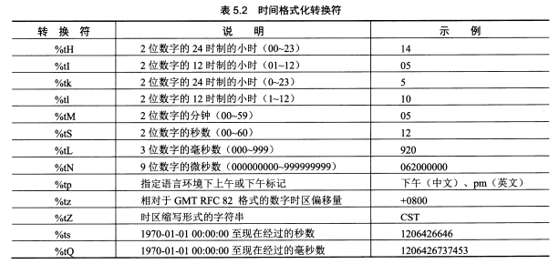

# 基本操作

## windows 命令行：

```java
javac Xcgj.java
```
将Xcgj.java源程序编译成Xcgj.class字节码文件
```java
javac Xcgj
```
把Xcgj.class字节码文件给JVM运行
>注意事项:
Xcgj.java这个文件名需要匹配文件内部声明的类“Xcgj”

## eclipse操作

|快捷键|操作|
|---|---|
|Ctrl+Alt+/| 自动补全java关键字|
|Alt+/| 启动代码辅助菜单|
|Ctrl+1| 代码修正|
|F5| 调试进入代码行|
|F6| 调试跳过代码行|

## inteliJ IDEA操作

|快捷键|操作|
|---|---|
|Alt+Enter| 自动导入包|
|shift+f10| 运行程序|

## 字符串

- str.length() 算长度
- str.indexOf(String) 查找第一个子串的位置
- str.lastIndxOf(String) 查找最后一个子串的位置
- str.charAt(int) 找指定位置的字符
- str.substring(int beginIndex) 获取子串
- str.substring(int beginIndex, int endIndex) 获取子串
- str.trim() 去除前后空格
- str.replace(char old, char new) 替换
- str.startsWith(String) 判断起始子串
- str.endsWith(string) 判断结束子串
- str.equals(String) 比较
- sre.equalsIgnoreCase(String) 比较忽略大小写
- ==：比较两个字符串的地址是否相同
- str.compareTo(String s) 字典顺序比较str和s，str在s之前，返回-1；str在s之后，返回1；否则返回0
- str.toLowerCase() 转小写
- str.toUpperCase() 转大写
- str.split(String); 分割
- str.split(String, int); 分割并限定次数
- String.format(String format, ...) 格式化字符串

格式化符参见书本P97-P100




正则表达式，书本P101-P102


## StringBuilder

- builder.append(anyType)
- builder.insert(int index, anyType)
- builder.delete(int startIndex, int endIndex)
- builder.toString()

## 数组

- import java.util.Arrays;
- Arrays.fill(arrayName, int val); 替换整个数组
- Arrays.fill(arrayName, int fromIndex, int toIndex, int val); 替换数组部分成员
- Arrays.sort(arrayName); 升序排列数组
- Arrays.copyOf(arrayName, int newlen) 拷贝数组
- Arrays.copyOfRange(arrayName, int fromIndex, int toIndex) 范围拷贝数组
- Arrays.binarySearch(arrayName,key); 二分法检索已排序的队列
- Arrays.binarySearch(arrayName,int fromIndex, int toIndex, key); 二分法范围检索已排序的队列

>array中存在key则返回index，否则返回第一个大于key的index，"-"表示插入位置
```java
import java.util.Arrays;
public class xcgj {
    public static void main(String[] args){
        int arr[] = new int[]{8,2,1,4,10};
        Arrays.sort(arr);//1,2,4,8,10
        int index = Arrays.binarySearch(arr,11);
        int len = arr.length;
        System.out.println(index);
        System.out.println(len);
    }
}
```
```
-6
5
```

## 类

- 类的成员变量在声明时必须定义初始值
- 可以用 `this` 关键字调用构造方法
```java
public class xcgj {
    public xcgj(){
        this("this调用有参构造");
        System.out.println("无参构造");
    }

    public xcgj(String str){
        System.out.println(str);
    }

    public static void main(String[] args){
        xcgj xj = new xcgj();
    }
}
```
```
this调用有参构造
无参构造
```
- JVM垃圾回收条件：`new`出来的对象结束作用域或被赋值为`null`。`finalize()`用于回收非`new`对象，会在垃圾回收之前调用。
- `System.gc()`可强制启动垃圾回收，防止JVM内存耗尽无法启动finalize()和垃圾回收。
- `DecimalFormat`类：格式化数字。P160


- `Math.random()` 随机0-1间的小数
```java
n + Math.random()*(m-n); //n-m间的随机数
```
```java
(char)(char1 + Math.random()*(char2 - char1 + 1));//char1-char2间的字符
```
- `Random`类也能产生随机数

## 继承

- java中继承时，子类添加关键字`extends`
- 子类重写父类方法，可更改父类方法的访问权限和返回值
- `super()`可调用父类构造方法，`super.XX()`调用父类方法
- 返回值、方法名、参数个数和类型一致，但是实现不同的重写称为重构
- 子类修改父类的方法权限只能往大范围修改，如：不能将`protected`改成`private`

__xcgj.java文件__
```java
public class xcgj {
    public xcgj(){
        this("父类: this调用有参构造");
        System.out.println("父类: 无参构造");
    }

    public xcgj(String str){
        System.out.println(str);
    }

    protected void doSomething(int a, String b){
        System.out.println(b + a);
    }

    protected void reStruct(int a, int b){
        System.out.println(b + a);
    }
}
```
__rbmw.java文件__
```java
public class rbmw extends xcgj {//继承xcgj类

    public rbmw(){
        //super();//在这里调不调用super()的结果都一样，因为在子类构造前，必先会完成父类的构造。因此super()多用于调用父类有参构造
        System.out.println("子类: 无参构造");
    }

    public void doSomething(){//重写
        System.out.println("子类: 重写doSomething");
    }

    protected void reStruct(int a, int b){//重构
        System.out.println("子类: 重构reStruct");
        System.out.println(b + a);
    }

    protected void test(String str, int a){
        System.out.println("子类自有方法调用父类方法：");
        super.doSomething(a, str);//显式调用父类方法
    }

    public static void main(String[] args) {
        rbmw  r = new rbmw();
        r.doSomething();
        r.reStruct(3,5);
        r.test("父类doSomething", 123);
    }
}
```
__输出结果__
```
父类: this调用有参构造
父类: 无参构造
子类: 无参构造
子类: 重写doSomething
子类: 重构reStruct
8
子类自有方法调用父类方法：
父类doSomething123
```
- 子类重写`finalize()`清理对象，需要最后调用父类的`finalize()`，保证自动构造的父类对象被清理
- `Object`类是所有类的顶级父类
- `getClass()`返回对象执行时的`Class`实例，用此实例调用`getName()`返回类名
- 类转换为字符串 或 与字符串相连，自动调用`toString()`方法
```java
public class rbmw {//默认继承Object类
    public String toString(){
        return getClass().getName() + "重写toString";//获取类名
    }
    public static void main(String[] args) {
        System.out.println(new rbmw());//类自动调用toString()方法
    }
}
```
```
rbmw重写toString
```
- `equals()`在`Object`类中默认使用`==`比较对象的引用地址，子类需要按需重写该方法
- `parentClassIns instanceof Class`判断`parentClassIns`对象是否为`Class`类的一个实例
- 不定长参数的方法的写法：`返回值 方法名(参数类型...参数名称)`
```java
public class rbmw {
    public static int test(int...a){//不定参
        int sum = 0;
        for (int x: a) {
            sum += x;
        }
        return sum;
    }

    public static int test(int a, int b){
        return a*b;
    }

    public static void main(String[] args) {
        rbmw r = new rbmw();
        System.out.println(r.test(5,7));//重载优先调用非不定参方法
        System.out.println(r.test(8));
    }
}
```
```
35
8
```
- abstract定义抽象类或抽象方法
```java
public abstract class rbmw {//抽象类
    //static和abstract关键字不共用
    //抽象方法没有实现体
    //每个子类必须用相同的方法名、参数列表和返回值实现该方法或创建抽象方法
    //包含了抽象方法的类必定是抽象类
    public abstract int test(int... a);
}
```
- `interface`接口定义

__抽象父类__
```java
public abstract class xcgj {
    protected abstract int test2();
}
```
__接口__
```java
public interface c01cpp {//接口interface关键字
    //接口方法省略关键字abstract，访问权限一定是public
    void inters(int a);
    //接口的任何字段都是static和final
}
```
__子类__
```java
public class rbmw extends xcgj implements c01cpp{//implements关键字使用接口

    public void inters(int a){//参数类型、参数数量、返回值和访问权限不可更改

    }

    public int test2() {//参数类型、参数数量、返回值不可更改，访问权限可向上更改
        return 0;
    }

    public static void main(String[] args) {
        System.out.println("");
    }
}
```
- 使用多个接口
```java
public class rbmw extends xcgj implements c01cpp, c02cpp{
}
```
- 接口继承接口
```java
public interface c01cpp extends c02cpp{
}
```

# java核心技术

## 类包

- 包的声明
```java
package cly.wt;//test这个类所属的包，一般包名小写
public class test {
}
```

- 包的导入

```java
import jyc.*;//导入jyc包内的所有类，但是子包内的类不会自动导入
import jyc.inn.Math;//手动指定导入子包中的Math类
import static java.lang.Math.max;//导入静态成员方法
import static java.lang.System.out;//导入静态成员变量

public class mainRun {
    public static void main(String[] args){
        rbmw rm = new rbmw();
        Math mt = new Math();//使用包的Math类
        double pi = java.lang.Math.PI;//显式使用JAVA的Math类
        out.println(rm.Math(max(5,10)));//静态成员的使用
    }
}
```

- 当用黑窗口运行含有包的`.class`文件时，要注意黑窗口的执行路径。如：
    - `server.java`源文件的里声明了`package Server;`
    - `server.class`文件所在路径为：`D:\Server\`
    - 那么黑窗口需要在`D:\`下运行：`java Server.server`

## final

- final:
final修饰类：该类不可继承，原子类
final修饰方法：该方法不能被子类覆盖（但它不能修饰构造函数）
final修饰字段属性：属性值第一次初始化后不能被修改

使用final可以提高程序执行的效率，将一个方法设成final后编译器就可以把对那个方法的所有调用都置入“嵌入”调用里。

- static:
static修饰方法：该方法不能使用this对象
static不能修饰构造方法、函数参数、局部成员变量
static修饰成员字段：当类被虚拟机加载时按照声明先后顺序对static成员字段进行初始化。
static修饰语句块：当类被虚拟机加载时按照声明先后顺序初始化static成员字段和static语句块

static所修饰的方法和字段只属于类，所有对象共享，java不能直接定义全局变量，是通过static来实现的。

- const

C++如果一个对象被定义成const，就不能调用对象的方法。除非这个方法被定义成const.

### final变量

- final研究

__cnTest.java__
```java
package consttest;

public class cnTest {
    public int value = 0;
}
```
__mainRun.java__
```java
import consttest.cnTest;
import java.util.Random;

public class mainRun {
    static Random rd = new Random();
    public  String toString(){
        return "final: " + VL_F + "\nstatic final: " + VL_SF;
    }

    //字段
    private final int VL_F = rd.nextInt(100);         //final变量
    private static final int VL_SF = rd.nextInt(100); //final static 变量
    private final static int VL_SF_ = rd.nextInt(100);//顺序不一致也没关系

    //数组
    private final int a[] = {1,2,3};
    private static final int b[] = {3,4,5};

    //对象
    private cnTest ct = new cnTest();
    private final cnTest ctf = new cnTest();
    private static final cnTest ctsf = new cnTest();

    public static void main(String[] args){
        mainRun mf = new mainRun();
        mainRun mf2 = new mainRun();
        System.out.println("mf: \n" + mf);//对象常量
        System.out.println("mf2: \n" + mf2);//类常量
        //mf.VL_F = 100;      //赋值失败
        //mf.VL_SF = 100;     //赋值失败
        //mf.VL_SF_ = 100;    //赋值失败

        for (int i = 0; i < mf.a.length; i++) {
            mf.a[i] = 1;
            mf.b[i] = 2;
        }
        int[] c = {5,6,7};
        //mf.a = c;           //赋值失败
        //mf.b = c;           //赋值失败

        mf.ct.value = 10;
        mf.ctf.value = 100;
        mf.ctsf.value = 1000;
        mf.ct = new cnTest();
        //mf.ctf = new cnTest();  //赋值失败
        //mf.ctsf = new cnTest(); //赋值失败
    }
}
```
```
mf:
final: 80
static final: 49
mf2:
final: 92
static final: 49
```
>结论：
`final` 和 `final static` 仅修饰的是对象引用的地址，对对象引用本身的成员没有做限定，成员依然可以修改
`final` 和 `final static` 的区别是：`final static`定义的变量分配了一个公共的内存区，是各个对象引用共享的，第一个对象引用产生 __前__ 变量值就不变了；`final`定义的变量是每个对象引用独有的，每个对象引用产生时都会重新分配一块内存保存变量值

- final的使用位置
```java
public class mainRun {
    final int VALUE = 0;    //成员变量不可改变
    final int BLANK_VALUE;  //声明final成员变量不赋值，称为空白final
    public mainRun(){
        BLANK_VALUE = 2;    //构造方法中给空白final赋值
    }

    public int func(final int a){//不可以改变参数的值，相当于C++：const int a
        final int b = 10;   //局部变量，不可改变
        //a = a + b;        //错误用法  
        return a + b;
    }
}
```
### final方法

- final方法不能被子类定义与修改，并且效率高于非final方法
- private权限的方法隐式被指定为final方法
- private final修饰的方法，子类可以声明同名方法，但不是父类方法的重写，而是新增的方法

__fnTestParent.java__
```java
package finaltest;

public class fnTestParent {
    final void funcF(){
        System.out.println("父类final方法");
    }

    private final void funcPF(){
        System.out.println("父类private final方法");
    }
}
```
__mainRun.java__
```java
import finaltest.fnTestParent;

public class mainRun extends fnTestParent {
    final void funcF(){
        System.out.println("子类final方法");
    }

    public final void funcPF(){
        System.out.println("子类private final方法");
    }

    public void func(){
        System.out.println("子类func方法");
    }

    public static void main(String[] args){
        mainRun mr = new mainRun();
        mr.funcF();
        mr.funcPF();

        fnTestParent ftp = mr;
//        ftp.funcF();      //调用失败
//        ftp.funcPF();     //调用失败
//        ftp.func();       //调用失败

        ((mainRun) ftp).func();
        ((mainRun) ftp).funcF();
        ((mainRun) ftp).funcPF();
    }
}
```
```
子类final方法
子类private final方法
子类func方法
子类final方法
子类private final方法
```

### final类
- final类无法被继承
- final类的方法都被隐式为final
- final类的成员变量可以被定义为final或非final

## 内部类

在A类中再定义一个B类。B类为内部类，A类为外部类。

### 成员内部类

- 内部类可以任意访问外部类的方法和成员变量，外部类则不能直接访问内部类
- 要想获得内部类的对象引用，必先获得外部类的对象引用
```java
public class OuterClass {    
    class InnerClass {
        public int y = 0;
        public void infunc(){
            x++;
        }
    }

    InnerClass inn = new InnerClass();
    private int x = 0;
    public InnerClass getInnerClass(){
        //y--;      //调用失败，不能直接访问
        inn.y--;
        return inn;
    }

    public static void main(String[] args){
        OuterClass oc = new OuterClass();               //实例化外部类的对象引用
        OuterClass.InnerClass ic = oc.getInnerClass();  //方法1：外部类对象引用的非静态方法实例化内部类的对象引用
        OuterClass.InnerClass ics = oc.new InnerClass();//方法2：外部类对象引用的new方法实例化内部类的对象引用
    }
}
```
- 内部类实现接口的技术

内部类继承接口并实现其中方法；外部类产生内部类对象引用，但是实际返回接口对象引用；在外部调用时，使用接口类对象接收返回的接口对象引用，调用接口方法
__testInterface.java__ 接口类
```java
package interfacepackage;

public interface testInterface {
    public void func();
}
```
__OuterClass.java__
```java
import interfacepackage.testInterface;

public class OuterClass {
    class InnerClass implements testInterface {//内部类继承接口类
        public void func(){         //实现接口
            System.out.println("InnerClass对func()的实现");
        }
    }

    public testInterface getInstance(){
        return new InnerClass();    //返回内部类
    }

    public static void main(String[] args){
        OuterClass oc = new OuterClass();       //实例化外部类的对象引用
        testInterface tif = oc.getInstance();   //返回testInterface接口类的对象引用
        tif.func();                 //完全隐藏了内部类
    }
}
```
```
InnerClass对func()的实现
```

- this可获取内部类和外部类的引用
```java
public class OuterClass {
    public int x = 10;
    private void xcgj(){
        System.out.println("外部类xcgj()的实现");
    }

    class InnerClass {
        public int x = 20;
        public void xcgj(){
            System.out.println("内部类xcgj()的实现");
        }

        public void func(int x){
            System.out.println(x);
            System.out.println(this.x);
            System.out.println(OuterClass.this.x);

            this.xcgj();
            OuterClass.this.xcgj();
        }
    }

    public InnerClass getInstance(){
        return new InnerClass();    //返回内部类
    }

    public static void main(String[] args){
        OuterClass oc = new OuterClass();//实例化外部类的对象引用
        OuterClass.InnerClass oi = oc.getInstance();
        oi.func(30);
    }
}
```
```
30
20
10
内部类xcgj()的实现
外部类xcgj()的实现
```

### 局部内部类

类的方法或任何作用域中均可定义内部类
```java
package interfacepackage;

public interface testInterface {
    public void xcgj();
}

```
```java
import interfacepackage.testInterface;

public class OuterClass {

    public testInterface getInstance(final int a){//a必须为final限定
        class InnerClass implements testInterface{
            public void xcgj(){
                //a += a;
                int b = 10;
                b += a;
                System.out.println("局部内部类实现接口：" + b);
            }
        }
        return new InnerClass();    //返回内部类
    }

    public static void main(String[] args){
        OuterClass oc = new OuterClass();//实例化外部类的对象引用
        testInterface tif = oc.getInstance(10);//接口类的对象引用接收
        tif.xcgj();
    }
}
```
```
局部内部类实现接口：20
```

### 匿名内部类

在函数返回时定义了一个类
```java
import interfacepackage.testInterface;

public class OuterClass {

    public testInterface getInstance(final int a){//a必须为final限定
        return new testInterface(){
            public void xcgj(){
                //a += a;
                int b = 10;
                b += a;
                System.out.println("局部内部类实现接口：" + b);
            }
        };    //返回内部类，注意分毫，return表达式的结束
    }

    public static void main(String[] args){
        OuterClass oc = new OuterClass();//实例化外部类的对象引用
        testInterface tif = oc.getInstance(10);
        tif.xcgj();
    }
}
```

### 静态内部类

- 外部类永远都是非静态的
- 类定义前用static的内部类称为静态内部类
- 静态内部类没用外部类的引用，只能访问外部类的静态成员
- 静态内部类在外部类的对象间共享，不需要依赖特定的外部类的对象引用也能产生对象

```java
public  class OuterClass {
    public static int x = 10;
    private void xcgj(){
        System.out.println("外部类xcgj()的实现");
    }

    static class InnerClass {
        public void doit(){
            x = 20;     //静态内部类只能调用外部类的静态成员
            //xcgj();   //报错
        }
    }

    public static void main(String[] args){
        OuterClass oc = new OuterClass();//实例化外部类的对象引用
        //静态内部类在外部类的对象间共享，不需要依赖特定的外部类的对象引用
        //OuterClass.InnerClass oic = oc.new OuterClass.InnerClass();//报错
        OuterClass.InnerClass oi = new OuterClass.InnerClass();
    }
}
```

### 普通类继承内部类

- 由于非静态内部类依赖于外部类，所以继承非静态内部类，子类构造时需要传一个外部类的对象引用
- 继承静态内部类，子类构造时不需要传一个外部类的对象引用
__非静态__
```java
package inheritinnerclass;

public class OutRbmw {
    public class InnerRbmw{
        public String toString(){
            return "OutRbmw.InnerRbmw的toString";
        }
    }
}
```
```java
import inheritinnerclass.OutRbmw;

public class xcgj extends OutRbmw.InnerRbmw {
    xcgj(OutRbmw a){
        a.super();//提供OutRbmw的构造完成InnerRbmw的构造
    }
    public static void main(String[] args){
        OutRbmw a = new OutRbmw();
        xcgj xc= new xcgj(a);
        System.out.println(xc);
    }
}
```
```
OutRbmw.InnerRbmw的toString
```

__静态__
```java
package inheritinnerclass;

public class OutRbmw {
    public static class InnerRbmw{
        public String toString(){
            return "OutRbmw.InnerRbmw的toString";
        }
    }
}
```
```java
import inheritinnerclass.OutRbmw;

public class xcgj extends OutRbmw.InnerRbmw {
    public static void main(String[] args){
        System.out.println(new OutRbmw.InnerRbmw());
    }
}
```
```
OutRbmw.InnerRbmw的toString
```

## 异常处理

- try-catch

Exception类是异常类，catch后可调用以下函数获取异常信息
|方法名|异常信息|
|---|---|
|getMessage()|错误性质|
|toString()|异常类型与性质|
|ptintStackTrace()|异常的类型、性质、栈层次、出现在程序中的位置|

- finally

无论有没有发生异常，finally语句块都会被执行。不执行的情况：
finally语句块发生异常
finally语句块前调用System.exit()
finally语句块所在线程死亡
关闭CPU

- 自定义异常

__MyException.java__
```java
package myexception;

public class MyException extends Exception {
    public String toString(){
        return "自定义异常";
    }
}
```
__xcgj.java__
```java
import myexception.MyException;

public class xcgj {
    //方法体内有throw关键字抛出异常时，声明必须有throws关键字指定异常类型
    public void throwException() throws MyException{
        throw new MyException();
    }
    public static void main(String[] args){
        xcgj xg = new xcgj();
        try{
            xg.throwException();
        }
        catch (Exception e){
            System.out.println(e);
        }
    }
}
```
```
自定义异常
```

## Swing基础

- Swing的目的是提供一个图形用户界面(GUI)，简单理解Swing类似于MFC
- Swing的继承关系：


|类|功能|
|---|---|
|Component|大多数Swing组件的直接父类或间接父类|
|Container|`java.Window`和`java.awt.Frame`的父类，Swing组件也扩展了这两个类|
|JComponent|Swing组件各种特性的存放位置，如：设置组件边界、GUI组件自动滚动|
- 常用的Swing组件


### 窗体
- JFame

JFame实例化后，还不能装载Swing组件，需要用getContentPane()转化成Container容器，再用Container对象装载组件
```java
mport javax.swing.*;
        import java.awt.*;

public class xcgj extends JFrame {
    public void CreateJFrame(String title){
        JFrame jf = new JFrame(title);              //实例化一个窗体
        Container cn = jf.getContentPane();         //将窗体转换为容器
        cn.setBackground(Color.YELLOW);             //窗体背景色

        JLabel jl = new JLabel("xcgj窗口");         //创建标签对象
        jl.setHorizontalAlignment(SwingConstants.CENTER);//标签文字居中
        cn.add(jl);                                 //容器添加标签对象

        jf.setVisible(true);                        //使窗体可视
        jf.setSize(400, 300);                       //窗体宽、高
        jf.setDefaultCloseOperation(WindowConstants.EXIT_ON_CLOSE);//窗体关闭方式
    }
    public static void main(String[] args){
        xcgj xg = new xcgj();
        xg.CreateJFrame("标题");
    }
}
```

>窗口关闭参数

|宏|含义|
|---|---|
|DO_NOTHING_ON_CLOSE|什么都不做就关闭窗口|
|HIDE_ON_CLOSE|隐藏窗口就关闭窗口|
|DISPOSE_ON_CLOSE|当处理Java虚拟机（VM）内的最后一个可显示窗口被关闭时，VM可以终止|
|EXIT_ON_CLOSE|退出应用程序就关闭窗口|

- JDialog

__MyDialog.java__ 弹窗
```java
package myframe;
import javax.swing.*;
import java.awt.*;

public class MyDialog extends JDialog {
    public MyDialog(JFrame frame){
        super(frame, "MyDialog测试", true);
        Container cn = getContentPane();
        cn.setBackground(Color.red);
        this.setSize(200,200);
        cn.add(new JLabel("MyDialJog内容"));
    }
}
```

__MyFrame.java__ 主窗口
```java
package myframe;
import javax.swing.*;
import java.awt.*;
import java.awt.event.ActionEvent;
import java.awt.event.ActionListener;

public class MyFrame extends JFrame {
    public MyFrame(){
        Container cn = getContentPane();//this窗体转容器
        cn.setLayout(null);             //布局
        cn.setBackground(Color.green);             //窗体背景色

        JButton bt = new JButton("对话框测试");
        bt.setBounds(100, 100, 100, 30);
        bt.addActionListener(           //监听事件
                new ActionListener() {
                    @Override
                    public void actionPerformed(ActionEvent e) {
                        MyDialog md = new MyDialog(MyFrame.this);
                        md.setVisible(true);
                    }
                }
        );
        cn.add(bt);

        setSize(400, 300);
        this.setVisible(true);
        setDefaultCloseOperation(WindowConstants.EXIT_ON_CLOSE);
    }
}
```

__xcgj.java__ 调用
```java
import myframe.MyFrame;

public class xcgj {
    public static void main(String[] args){
        new MyFrame();
    }
}
```


### 布局


### 组件


### 事件监听


## 集合基础

- 集合即容器，STL


- iterator的用法

```java
import java.util.*;

public class xcgj {
    public static void main(String[] args){
        Collection<String> list = new ArrayList<>();
        list.add("xcgj");
        list.add("rbmw");
        list.add("c01cpp");
        Iterator<String> iter = list.iterator();
        while (iter.hasNext())
        {
            System.out.println(iter.next());
        }
    }
}
```
```
xcgj
rbmw
c01cpp
```

### List

- 子类ArrayList类实现原理：数组
- 子类LinkedList类实现原理：链表
- List类常用方法：`get(int)`, `set(int, Object)`

### Set

- 子类HashSet类实现原理：HashMap，不排序，可以是null
- 子类TreeSet类实现原理：红黑树，插入自动排序，不为null


- Set的元素不重复

### Map


- HashMap基于哈希表，用哈希码快速查找映射关系，效率高，键、值可为null
- TreeMap性能较差，但插入时自动排序，键、值不能为null

## 文件操作

- `InputStream`和`OutputStream`处理字节
- `Reader`和`Writer`处理字符


### File类

```java
import java.io.File;

public class xcgj {
    public static void main(String[] args){
        //全路径
        File file = new File("D:\\test\\c01cpp.txt");
        System.out.println(file.exists());
        File file2 = new File("d:/test/c01cpp.txt");
        System.out.println(file2.exists());
        //父路径+子路径
        File file3 = new File("d:/test", "c01cpp.txt");
        System.out.println(file3.exists());
        File file4 = new File("d:/", "test/c01cpp.txt");
        System.out.println(file4.exists());
        //父file+子路径
        File file5 = new File("d:/");
        File file6 = new File(file5,"test/c01cpp.txt");
        System.out.println(file6.exists());
    }
}
```


### 文件读写

- `FileInputStream`和`FileOutputStream`都只提供对字节或字节数组的读取方法，单个字符占用多个字节读取时可能会乱码

```java
import java.io.File;
import java.io.FileInputStream;
import java.io.FileOutputStream;

public class xcgj {
    //读文件
    public static void ReadFileContent(File file) {
        try {//必须要加try
            FileInputStream fileInputStream = new FileInputStream(file);
            byte[] byteArray = new byte[1024];//字节数组
            int len = fileInputStream.read(byteArray);//将file文件内容读到字节数组
            String content = new String(byteArray, 0, len);//字节数组转String
            System.out.println(content);
            fileInputStream.close();
        }
        catch (Exception e) {
            e.printStackTrace();
        }
    }
    //写文件
    public static void WriteFileContent(File file, String content){
        try {
            FileOutputStream fileOutputStream = new FileOutputStream(file);
            byte[] byteArray = content.getBytes();//String 转 字节数组
            fileOutputStream.write(byteArray);
            fileOutputStream.close();
        }
        catch (Exception e){
            e.printStackTrace();
        }
    }

    public static void main(String[] args){
        xcgj xg = new xcgj();
        File file = new File("d:/test/c01cpp.txt");
        xg.WriteFileContent(file, "璧立千仞，无欲则刚");
        xg.ReadFileContent(file);
    }
}
```
```
璧立千仞，无欲则刚
```

- `FileReader`和`FileWriter`可以对字符进行读取

```java
import java.io.File;
import java.io.FileReader;
import java.io.FileWriter;

public class xcgj {
    //读文件
    public static void ReadFileContent(File file) {
        try {//必须要加try
            FileReader fileReader = new FileReader(file);
            char[] byteArray = new char[1024];//字符数组
            int len = fileReader.read(byteArray);     //将file文件内容读到字符数组
            String content = new String(byteArray, 0, len);
            System.out.println(content);
            fileReader.close();
        }
        catch (Exception e) {
            e.printStackTrace();
        }
    }
    //写文件
    public static void WriteFileContent(File file, String content){
        try {
            FileWriter fileWriter = new FileWriter(file);
            fileWriter.write(content);
            fileWriter.close();
        }
        catch (Exception e){
            e.printStackTrace();
        }
    }

    public static void main(String[] args){
        xcgj xg = new xcgj();
        File file = new File("d:/test/c01cpp.txt");
        xg.WriteFileContent(file, "海纳百川，有容乃大");
        xg.ReadFileContent(file);
    }
}
```
```
海纳百川，有容乃大
```

- 给文件读写增加缓存功能

主要操作的类：`BufferedInputStream`、`BufferedOutputStream`、`BufferedReader`、`BufferedWriter`
以`FileReader`和`FileWriter`类为例：
```java
import java.io.*;

public class xcgj {
    //读文件
    public static void ReadFileContent(File file) {
        try {//必须要加try
            FileReader fileReader = new FileReader(file);
            BufferedReader bufferedReader = new BufferedReader(fileReader);//增加读缓存
            String content = null;
            while ((content = bufferedReader.readLine()) != null){//行读取
                System.out.println(content);
            }
            bufferedReader.close();
            fileReader.close();
        }
        catch (Exception e) {
            e.printStackTrace();
        }
    }
    //写文件
    public static void WriteFileContent(File file, String[] content){
        try {
            FileWriter fileWriter = new FileWriter(file);
            BufferedWriter bufferedWriter = new BufferedWriter(fileWriter);//增加写缓存
            for (String str: content) {
                bufferedWriter.write(str);
                bufferedWriter.newLine();//增加行分隔符
            }
            bufferedWriter.close();
            fileWriter.close();
        }
        catch (Exception e){
            e.printStackTrace();
        }
    }


    public static void main(String[] args){
        xcgj xg = new xcgj();
        File file = new File("d:/test/c01cpp.txt");
        xg.WriteFileContent(file, new String[]{"海纳百川", "有容乃大", "璧立千仞", "无欲则刚"});
        xg.ReadFileContent(file);
    }
}
```
```
海纳百川
有容乃大
璧立千仞
无欲则刚
```

- 数据输入输出流

以与机器无关的方式读取基本java数据类型，不关心字节
```java
import java.io.*;

public class xcgj {
    public static void main(String[] args){
        try {
            String fileName = new String("d:/test/c01cpp.txt");
            FileInputStream fileInputStream = new FileInputStream(fileName);
            DataInputStream dataInputStream = new DataInputStream(fileInputStream);
            FileOutputStream fileOutputStream = new FileOutputStream(fileName);
            DataOutputStream dataOutputStream = new DataOutputStream(fileOutputStream);

//            dataOutputStream.writeBytes("writeBytes文件写入");//文件内容乱码
//            System.out.println(dataInputStream.readByte());//显示乱码

//            dataOutputStream.writeChars("的writeChars文件写入");//文件内容乱码
//            System.out.println(dataInputStream.readChar());//显示单个字符

            dataOutputStream.writeUTF("writeUTF文件写入");//文件内容乱码
            System.out.println(dataInputStream.readUTF());
        }
        catch (Exception e){
            e.printStackTrace();
        }
    }
}
```
```
writeUTF文件写入
```

- 文件压缩


```java
import java.io.*;
import java.util.zip.ZipEntry;
import java.util.zip.ZipOutputStream;

public class xcgj {
    public static void zip(String zipName, File file) throws Exception{//若有异常，向上抛出
        FileOutputStream fileOutputStream = new FileOutputStream(zipName);//文件
        ZipOutputStream zipOutputStream = new ZipOutputStream(fileOutputStream);
        zip(zipOutputStream, file, "");
        zipOutputStream.close();
    }

    public static void zip(ZipOutputStream zipOutputStream, File file, String head)throws Exception{
        if (file.isDirectory()){//目录，向下递归
            File[] fileList = file.listFiles();//当前文件夹下的所有文件和文件夹
            if (head.length() != 0){
                zipOutputStream.putNextEntry(new ZipEntry(head + "/"));//创建新插入目录节点
            }
            for (File tempFile: fileList) {
                zip(zipOutputStream, tempFile, head + tempFile);//递归
            }
         }
        else {  //文件，读取并压缩
            zipOutputStream.putNextEntry(new ZipEntry(head));   //创建新插入文件节点
            FileInputStream fileInputStream = new FileInputStream(file);
            int b;
            while ((b = fileInputStream.read()) != -1){
                zipOutputStream.write(b);       //插入文件压缩数据
            }
            fileInputStream.close();
        }
    }

    public static void main(String[] args){
        xcgj xg = new xcgj();
        try {
            xg.zip("D:/test.zip", new File("test"));
        }
        catch (Exception e){
            e.printStackTrace();
        }
    }
}
```

- 文件解压


```java
import java.io.*;
import java.util.zip.ZipEntry;
import java.util.zip.ZipFile;
import java.util.zip.ZipInputStream;

public class xcgj {
    public static void unzip(String zipPath, String dstPath) throws Exception{
        //初始化文件操作对象
        File file = new File(zipPath);
        ZipFile zipFile = new ZipFile(file);
        FileInputStream fileInputStream = new FileInputStream(file);
        ZipInputStream zipInputStream = new ZipInputStream(fileInputStream);

        //找到文件节点，循环解压
        ZipEntry zipEntry = null;
        while (null != (zipEntry = zipInputStream.getNextEntry()) && false == zipEntry.isDirectory()){
            File tempFile = new File(dstPath + zipEntry.getName());
            if (tempFile.exists() == false){//存在同名根目录就不解压
                tempFile.getParentFile().mkdirs();
                OutputStream outputStream = new FileOutputStream(tempFile);//文件目录中的文件放入输入流
                InputStream inputStream = zipFile.getInputStream(zipEntry);//输入流读取压缩文件中指定目录中的文件
                int count = 0;
                while ((count = inputStream.read()) != -1){
                    outputStream.write(count);
                }
                outputStream.close();
                inputStream.close();
            }
        }
        zipInputStream.close();
    }

    public static void main(String[] args){
        xcgj xg = new xcgj();
        try {
            xg.unzip("D:/test.zip", "D:/unzipTest/");
        }
        catch (Exception e){
            e.printStackTrace();
        }
    }
}
```

## 反射

反射就是通过一个类实例对象，通过一些方法查询这个对象所属的类的相关消息。
- getFields()和getMethods()方法依次获得权限为public的成员变量和成员方法时，将包含从超类中继承得到的成员变量和方法。
- getDeclaredFields()和getDeclaredMethods()只是获得在本类中定义的所有成员变量和方法
- 访问构造方法：返回Constructor类型的对象或数组
- 访问变量：返回Field类型的对象或数组
- 访问方法：返回Method类型的对象或数组
- Annotation功能只是给程序添加注释，不影响程序的运行。程序运行时可以通过Annotation功能访问到类、构造方法、成员变量、成员方法、参数等的说明
- Annotation的关键子：@interface
- 注解详细介绍：https://www.cnblogs.com/xdp-gacl/p/3622275.html

## 枚举与泛型

### 枚举

- 每一个枚举类型成员都可以看作是枚举类型的一个实例
- 枚举类型成员可以有构造方法，枚举类型可以有成员方法和成员变量
- 枚举类型可以继承接口，这样每个枚举类型成员都要实现接口里的方法

### 泛型

- `public class Tclass<T1, T2>{}` 泛型类
- 限制泛型可用类型： `public class Tclass<T externs List>{}`, 设置泛型类型必须是List或List的子类
- 通配符按照包含范围划分可以分为三种：
    - 无界通配符，也就是 <?> 这种表示形式，含义是表示全部实参集合中的任意一种实参类型；
    - 上界通配符，用 externs 关键字确定上界， 类似 <? externs Number> 可以表示包含 Number 以及其所有子类的类型组成的集合中的任何一种实参类型（注意这里的 extends 关键字并不是我们常见的继承的含义，他只是复用 extends 关键字来界定范围）；
    - 下界通配符，用 super 关键字确定下界，类似 <? super Number> 可以表示包含 Numbe r以及其所有父类的类型组成的集合中的任何一种实参类型。

    >但是使用上下限界配符通也会有限制，例如用上界 ArrayList<? externs Number> list = new ArrayList<Long> () 定义的 list，我们调用 list.get() 往外取数据是可以的，因为编译器知道取出来的数据一定是 Numbe r的子类，但是 __当我们要往其中添加数据时，例如 list.add(1L)，编译器是不允许这种操作的__ ，原因是 ArrayList<? externs Number> 对于编译器来说，它并不能确定其真实代表的实参是哪一种子类，这样不能保证类型安全。

## 线程

### 线程的实现方式
- 继承Thread类

```java
package ThreadTest;

public class threadTest extends Thread {
    public void run(){
        //执行线程任务
        //while (true) {...}
    }

    public static void main(String[] args) {
        threadTest threadtest = new threadTest();
        threadtest.start();//启动线程
    }
}
```

- 实现Runnable接口——解决多重继承的问题
    - 建立Runnable对象
    - 使用Runnable对象作为参数建立Thread实例
    - 使用start()方法启动线程

```java
public class tnreadRunnable extends JFrame implements Runnable{
    public void run(){}
}
```

```java
package ThreadTest;
import javax.swing.*;

public class tnreadRunnable extends JFrame{//继承窗口类
    Thread thread;
    public void startRun() {
        thread = new Thread(new Runnable() {//实现Runnable接口
            @Override
            public void run() {
                //执行线程任务
                //while (true) {...}
            }
        });
        thread.start();//启动线程
    }

    public static void main(String[] args){
        tnreadRunnable tnreadrunnable = new tnreadRunnable();
        tnreadrunnable.startRun();
    }
}
```

- 线程的生命周期
    - 出生状态：调用start()方法之前
    - 就绪状态：调用start()方法之后，等待CPU时间片
    - 运行(可执行)状态：得到系统资源，获得CPU时间片
    - 等待状态：调用wait()方法后，需要用notify()或notifyAll()或interrupt()方法唤醒
    - 休眠状态：调用sleep()方法后，interrupt()方法或休眠结束可唤醒
    - 阻塞状态：发出输入/输出请求后
    - 死亡状态：run()方法执行完毕


### 线程的操作方法
- Thread.sleep() 休眠
- B线程使用B.join()加入A线程时，A线程会等待B线程运行完毕后再运行

```java
package ThreadTest;

public class JoinTest {
    private Thread threadA;
    private Thread threadB;

    JoinTest() {
        threadA = new Thread(new Runnable() {
            @Override
            public void run() {
                while (true) {
                    //线程A的任务
                    //...
                    try {
                        threadB.join();//线程A暂停，直到线程B死亡
                    }
                    catch (Exception e) {
                        e.printStackTrace();
                    }
                    //线程A的任务
                    //...
                }
            }
        });
        threadB = new Thread(new Runnable() {
            @Override
            public void run() {
                //线程B的任务
                //while (true) {...}
            }
        });
        threadA.start();
        threadB.start();
    }

    public static void main(String[] args) {
        JoinTest joinTest = new JoinTest();
    }
}
```

- Thread.interrupt()使线程停止sleep()或wait()或其他阻塞事件，离开run()方法，结束线程，可用于关闭数据库连接或关闭socket连接
- setPriority()设置线程优先级

### 线程同步

- 同步块
```java
package ThreadTest;

public class SynchronizeBlockTest implements Runnable{
    public static int num = 0;

    @Override
    public void run() {
        while (true) {
            synchronized ("") {
                num++;
                System.out.println(num);
            }
        }
    }

    public static void main(String[] args){
        SynchronizeBlockTest synchronizeBlockTest = new SynchronizeBlockTest();
        Thread threadA = new Thread(synchronizeBlockTest);
        Thread threadB = new Thread(synchronizeBlockTest);
        Thread threadC = new Thread(synchronizeBlockTest);
        Thread threadD = new Thread(synchronizeBlockTest);

        threadA.start();
        threadB.start();
        threadC.start();
        threadD.start();
    }
}
```

`synchronized (Object) {}`Object为任意一个对象，每个对象存在一个标志位，并具有两个值，分为0(忙)和1(闲)


- `synchronized void f() {}` 同步方法

多个线程都调用synchronized标志的同一方法时，只有一个线程能进入这个方法，其他线程等待
```java
package ThreadTest;

public class SynchronizeBlockTest implements Runnable{
    public static int num = 0;

    @Override
    public void run() {
        while (true) {
            add();
        }
    }

    public synchronized void add() {
        num++;
        System.out.println(num);
    }

    public static void main(String[] args){
        SynchronizeBlockTest synchronizeBlockTest = new SynchronizeBlockTest();
        Thread threadA = new Thread(synchronizeBlockTest);
        Thread threadB = new Thread(synchronizeBlockTest);
        Thread threadC = new Thread(synchronizeBlockTest);
        Thread threadD = new Thread(synchronizeBlockTest);

        threadA.start();
        threadB.start();
        threadC.start();
        threadD.start();
    }
}
```

## 网络通信

- socket的作用是将应用程序和端口绑定

### TCP

- TCP/IP 交互原理


- InetAdress类的常用方法


- ServerSocket类的常用方法


服务器代码：
```java
package TCP;
import java.io.BufferedReader;
import java.io.InputStreamReader;
import java.io.PrintWriter;
import java.net.ServerSocket;
import java.net.Socket;

import static java.lang.Thread.sleep;

public class server {
    public static final int PORT = 9988;
    private ServerSocket serverSocket;
//    private Thread thread;
    private int threadNumber = 0;//socket计数器
    private Socket socket;

    server() {
        try {
            serverSocket = new ServerSocket(PORT);

            while (true) {
                socket = serverSocket.accept();
                getClientMessage(socket, threadNumber);
                replyClientMessage(socket, threadNumber);
            }
        } catch (Exception e) {
            e.printStackTrace();
        }
    }
//        thread = new Thread(new Runnable() {
//            @Override
//            public void run() {
//                while (true) {
//                    try {
//                        Socket socket = serverSocket.accept();          //阻塞，等待消息
//                        threadNumber++;
//                        Thread threadObj = new Thread(new Runnable() {  //获取到消息后另起子线程接收和回复
//                            private int number = threadNumber;
//                            Socket socketTHD = socket;
//                            @Override
//                            public void run() {
//                                try {                                   //捕捉终止异常
//                                    while (true) {
//                                        getClientMessage(socketTHD, number);
//                                        replyClientMessage(socketTHD, number);
//                                    }
//                                }
//                                catch (Exception e) {
//                                    e.printStackTrace();
//                                }
//                                if (null != socketTHD){
//                                    try {
//                                        socketTHD.close();
//                                    }
//                                    catch (Exception e) {
//                                        e.printStackTrace();
//                                    }
//                                }
//                            }
//                        });
//                        threadObj.start();//启动子线程
//                    }
//                    catch (Exception e) {
//                        e.printStackTrace();
//                    }
//                }
//            }
//        });
//    }
//
//    public void startProcess() {
//        thread.start();
//    }
//
//    public void stopProcess() {
//        if (null != serverSocket) {
//            try {
//                serverSocket.close();
//            }
//            catch (Exception e) {
//                e.printStackTrace();
//            }
//        }
//    }

    //接收
    private void getClientMessage(Socket socket, int number) {
        try {
            BufferedReader bufferedReader = new BufferedReader(new InputStreamReader(socket.getInputStream()));
            String msg = bufferedReader.readLine();
            System.out.println("thread" + number + "receive msg:\n" + msg);
            //bufferedReader.close();
        }
        catch (Exception e) {
            e.printStackTrace();
        }
    }

    //回复
    public void replyClientMessage(Socket socket, int number) {
        try {
            PrintWriter printWriter = new PrintWriter(socket.getOutputStream(), true);
            printWriter.println("thread" + number + "reply msg: ok");
            printWriter.close();
        }
        catch (Exception e) {
            e.printStackTrace();
        }
    }

    public static void main(String[] args) {
        server s = new server();
//        s.startProcess();
//        try {
//            sleep(50000);
//        }
//        catch (Exception e) {
//            e.printStackTrace();
//        }
        //s.stopProcess();
        System.out.println("服务程序退出");
    }
}
```

客户端代码：
```java
package TCP;
import javax.swing.*;
import javax.swing.border.BevelBorder;
import java.awt.*;
import java.awt.event.ActionEvent;
import java.awt.event.ActionListener;
import java.io.BufferedReader;
import java.io.InputStreamReader;
import java.io.PrintWriter;
import java.net.Socket;

public class client extends JFrame {
    private JTextArea showText = new JTextArea();
    private JTextField inputText = new JTextField();
    private Container container;
    private PrintWriter printWriter;
    private Socket socket;
    private BufferedReader bufferedReader;

    public client () {
        super("client");
        WindowManage();
    }

    private void WindowManage() {
        setDefaultCloseOperation(JFrame.EXIT_ON_CLOSE);
        container = this.getContentPane();
        final JScrollPane scrollPane = new JScrollPane();
        scrollPane.setBorder(new BevelBorder(BevelBorder.RAISED));
        getContentPane().add(scrollPane, BorderLayout.CENTER);
        scrollPane.setViewportView(showText);
        container.add(inputText, "South");
        inputText.addActionListener(new ActionListener() {
            @Override
            public void actionPerformed(ActionEvent e) {
                try {
                    socket = new Socket("127.0.0.1", 9988);
                    bufferedReader = new BufferedReader(new InputStreamReader(socket.getInputStream()));
                    printWriter = new PrintWriter(socket.getOutputStream(),true);
                    showText.append(inputText.getText() + '\n');
                    printWriter.println(inputText.getText());
                    showText.setSelectionEnd(showText.getText().length());
                    inputText.setText("");
                    showText.append("connect complete\n");
                    showText.append("reply msg: \n" + bufferedReader.readLine() + '\n');
                }
                catch (Exception ex) {
                    ex.printStackTrace();
                }
            }
        });
    }

    public void connect() {
        showText.append("try to connect\n");
        try {
            socket = new Socket("127.0.0.1", 9988);
            bufferedReader = new BufferedReader(new InputStreamReader(socket.getInputStream()));
            //printWriter = new PrintWriter(socket.getOutputStream(),true);
            showText.append("connect complete\n");
        }
        catch (Exception e) {
            e.printStackTrace();
        }
    }

    public void communicate() {
        try {
            while (true) {
                printWriter = new PrintWriter(socket.getOutputStream(),true);
            }
        }
        catch (Exception e) {
            e.printStackTrace();
        }
    }

    public static void main(String[] args) {
        client c1 = new client();
        c1.setSize(500, 500);
        c1.setVisible(true);
        //c1.connect();
        //c1.communicate();
    }
}
```

### UDP

- 发送流程
    - DatagramSocket()创建数据包 发送socket
    - DatagramPacket(byte[] buf, int offset, int length, InetAddress inetAddress, int port)打包发送数据
    - DatagramSocket类的send()方法发送数据包
- 接收流程
    - DatagramSocket(port)创建数据包 接收socket
    - DatagramPacket(byte[] buf, int length)开辟数据包接收空间
    - DatagramSocket类的receive()方法接收数据包
- MulticastSocket是DatagramSocket的子类
- 要广播或接收广播的主机地址必须加入同一个广播组，地址范围为224.0.0.0~224.255.255.255

服务器代码：
```java
package server;

import java.net.DatagramPacket;
import java.net.InetAddress;
import java.net.MulticastSocket;

public class server extends Thread {
    public final static int PORT = 199;
    public final static String ADDRESS = "224.255.10.0";

    int port = PORT;
    InetAddress inetAddress = null;
    MulticastSocket multicastSocket = null;
    server(){
        try{
            inetAddress = InetAddress.getByName(ADDRESS);
            multicastSocket = new MulticastSocket(port);
            multicastSocket.setTimeToLive(1);       //指定发送范围是本地网络
            multicastSocket.joinGroup(inetAddress); //加入广播组
        }
        catch (Exception e){
            e.printStackTrace();
        }
    }

    public void run(){
        int count  = 1000;
        while(true){
            String msg = Integer.toString(count++);
            byte[] data = msg.getBytes();
            DatagramPacket datagramPacket = new DatagramPacket(data, data.length, inetAddress, port);
            System.out.println(new String(data));
            try {
                multicastSocket.send(datagramPacket);
                sleep(count);
            }
            catch (Exception e){
                e.printStackTrace();
            }
        }
    }

    public static void main(String[] args){
        server s = new server();
        s.start();
    }
}
```

客户端代码：
```java
package client;
import javax.swing.*;
import java.awt.*;
import java.awt.event.*;
import java.net.*;

public class client extends JFrame implements Runnable, ActionListener {
    public final static int PORT = 199;
    public final static String ADDRESS = "224.255.10.0";
    InetAddress inetAddress = null;
    MulticastSocket multicastSocket = null;
    Thread thread;
    boolean endThread = false;
    JButton startButton = new JButton("start");
    JButton stopButton = new JButton("stop");
    JTextArea currentMsgText = new JTextArea(10, 10);
    JTextArea historyMsgText = new JTextArea(10, 10);
    JPanel panelTop = new JPanel();
    JPanel panelBottom = new JPanel();

    public client() {
        super("broadcast");
        WindowStyle();      //布局设置
        thread = new Thread(this);
        try {
            inetAddress = InetAddress.getByName(ADDRESS);
            multicastSocket = new MulticastSocket(PORT);
            multicastSocket.joinGroup(inetAddress);
        }
        catch (Exception e){
            e.printStackTrace();
        }
    }

    @Override
    public void run() {
        while (false == endThread) {
            byte[] dataReceive = new byte[10240];
            DatagramPacket datagramPacket = new DatagramPacket(dataReceive, dataReceive.length, inetAddress, PORT);
            try {
                multicastSocket.receive(datagramPacket);
                String msg = new String(datagramPacket.getData(), 0, datagramPacket.getLength());
                SetMsgToShow(msg);  //显示消息到界面
            }
            catch (Exception e) {
                e.printStackTrace();
            }
        }
    }

    public void actionPerformed(ActionEvent e){
        if (e.getSource() == startButton) {
            startButton.setBackground(Color.gray);
            stopButton.setBackground(Color.white);
            if (false == thread.isAlive()) {
                thread = new Thread(this);
            }
            endThread = false;
            thread.start();
        }
        if (e.getSource() == stopButton) {
            startButton.setBackground(Color.white);
            stopButton.setBackground(Color.gray);
            endThread = true;
        }
    }

    public void WindowStyle(){
        setDefaultCloseOperation(WindowConstants.EXIT_ON_CLOSE);
        startButton.addActionListener(this);
        stopButton.addActionListener(this);
        currentMsgText.setForeground(Color.BLUE);
        panelTop.add(startButton);
        panelTop.add(stopButton);
        add(panelTop, BorderLayout.NORTH);
        panelBottom.setLayout(new GridLayout(1,2));
        panelBottom.add(currentMsgText);
        panelBottom.add(historyMsgText);
        add(panelBottom, BorderLayout.CENTER);
        validate();
        setBounds(100,50,360,380);
        setVisible(true);
    }

    public void SetMsgToShow(String msg) {
        currentMsgText.setText("receive：\n" + msg);
        historyMsgText.append(msg + "\n");
    }

    public static void main(String[] args) {
        client c = new client();
        c.setSize(500, 800);
    }
}
```


## 数据库

```java
package ThreadTest;
import java.sql.*;

public class SQLTest {
    public static void main(String[] args){
        try {
            //数据库连接对象
            Connection connection = DriverManager.getConnection("xcgj:mysql:" + "//127.0.0.1:5507/test", "userName", "passWord");
            Statement statement = connection.createStatement();//查询语句的对象
            ResultSet resultSet = statement.executeQuery("select * from tb_xcgj");
            while (resultSet.next()){//单行数据查询
                String id = resultSet.getString("id");//查询此行的某列字段的数据
                String name = resultSet.getString(2);//查询第二列
            }

            //模糊查询 _:一个字符  %:0-多个字符
            resultSet = statement.executeQuery("select * from tb_xcgj where name like 张_%");

            //预处理查询,先格式化查询语句对象，用的时候再赋值查询
            PreparedStatement preparedStatement = connection.prepareStatement("select * from tb_xcgj where id = ?");
            preparedStatement.setObject(1, "33");//1代表第一个"?"
            resultSet = preparedStatement.executeQuery();

            //增删改 insert update delete
            preparedStatement = connection.prepareStatement("inser into tb_xcgj values(?,?,?)");
            preparedStatement.setString(1, "rbmw");
            preparedStatement.setInt(2, 20);
            preparedStatement.setDouble(3, 0.01);
            preparedStatement.executeUpdate();
        }
        catch (Exception e) {
            e.printStackTrace();
        }
    }
}
```
